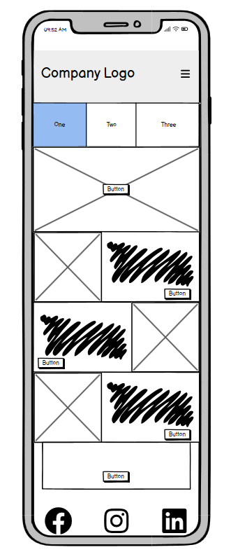

# EmpowerWork UK 🌍

*A static website that promotes awareness of UK workers’ rights, highlights organisations supporting underrepresented communities, and shares facts and statistics about diversity across industries such as tech.*

---

## ✊🏽 About

**EmpowerWork UK** is a personal/community-driven project built using **plain HTML, CSS, and bootstrap**.  

It reflects the perspective and values of a **mixed-race Jamaican-English developer** committed to inclusion, accessibility, and representation in the workplace.  

The site aims to empower individuals with clear, accessible information and highlight the organisations working to make UK employment fairer and more inclusive.

---

## 🎯 Goals

- Provide **easy-to-understand information** about UK workers’ rights  
- **List organisations and charities** that support workers from ethnic minority backgrounds and other underrepresented groups  
- Share **facts, figures, and statistics** about diversity and inclusion in industries such as tech and digital  
- Offer a **visually engaging but accessible** static experience with no sign-in or tracking required  
- Represent diversity through **inclusive design and facts**
- Demonstrate how AI and technology can **boost and fill skill gaps** that people from other backgrounds may face

---

## 👥 User Stories

1. **As a young Black/mixed race professional**, I want to find reliable information about my rights at work so I can advocate for myself and understand the protections available.  

2. **As a mixed-heritage creative entering tech**, I want to see real statistics about diversity in UK workplaces so I can understand where representation is improving and where it’s still needed.  

3. **As an HR manager**, I want to find charities and community organisations that promote inclusion so I can connect my company with trusted partners and resources, to help awareness, consideration and respect to others who may be in the workforce and difficulties that others may face based unique to their characteristics.

4. **As a worker with english not as a first language**, I want clear, jargon-free explanations of workers’ rights so that I can easily understand them even if English isn’t my first language.  

5. **As a student preparing to enter the workforce**, I want to learn about support networks, organisations and facts from people like me and others I may meet in my chosen industry.  

6. **As a community advocate**, I want to share a single link that helps others access rights information, support organisations, and data about representation across UK workplaces.  

---

## 🧱 Structure

A single mobile friendly scrollable site with anchor jump links to different sections

---

## 📐 Wireframes

---

## 🛠️ Tech Stack

- **HTML5** – for structure and semantic accessibility  
- **CSS3** – for styling and responsive design  
- **Bootstrap** – for assets and responsive design  
- **Data Sources:** GOV.UK, Office for National Statistics (ONS), and public reports  
- **Hosting:** GitHub Pages  

---

## 🧠 Accessibility & Inclusion

This site is built with accessibility and inclusion at its core:

Follows WCAG 2.1 AA guidelines where possible

Designed with high contrast and readable typography

Uses alt text and semantic HTML

Represents diverse voices and lived experiences in its information, resources and data
